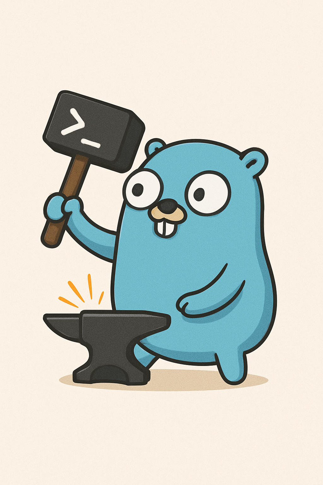

# Forge Framework

<p align="center">
  
</p>

Forge is a comprehensive Go framework and CLI tool for building production-ready microservices with standardized patterns.

## Architecture

Forge consists of two repositories:

1. **forge** (`github.com/dosanma1/forge`) - Reusable Go library with standardized patterns
2. **forge-cli** (`github.com/dosanma1/forge-cli`) - CLI tool for scaffolding and code generation

## Installation

### Install Forge CLI

```bash
git clone https://github.com/dosanma1/forge-cli
cd forge-cli
make install
```

### Prerequisites

Forge requires several tools to be installed depending on which features you want to use:

#### Essential Tools (Required for all features)

**Bazel** - Build system

- **macOS**: `brew install bazelisk`
- **Linux**:
  ```bash
  wget https://github.com/bazelbuild/bazelisk/releases/latest/download/bazelisk-linux-amd64
  chmod +x bazelisk-linux-amd64
  sudo mv bazelisk-linux-amd64 /usr/local/bin/bazel
  ```
- **Windows**: `choco install bazelisk` or download from [releases](https://github.com/bazelbuild/bazelisk/releases)

**Skaffold** - Development & deployment orchestration

- **macOS**: `brew install skaffold`
- **Linux**:
  ```bash
  curl -Lo skaffold https://storage.googleapis.com/skaffold/releases/latest/skaffold-linux-amd64
  chmod +x skaffold
  sudo mv skaffold /usr/local/bin
  ```
- **Windows**: `choco install skaffold` or download from [releases](https://github.com/GoogleContainerTools/skaffold/releases)

**Docker** - Container runtime

- **macOS**: Download [Docker Desktop for Mac](https://www.docker.com/products/docker-desktop)
- **Linux**:
  ```bash
  curl -fsSL https://get.docker.com -o get-docker.sh
  sudo sh get-docker.sh
  ```
- **Windows**: Download [Docker Desktop for Windows](https://www.docker.com/products/docker-desktop)

**Helm** - Kubernetes package manager

- **macOS**: `brew install helm`
- **Linux**:
  ```bash
  curl https://raw.githubusercontent.com/helm/helm/main/scripts/get-helm-3 | bash
  ```
- **Windows**: `choco install kubernetes-helm`

**kubectl** - Kubernetes CLI

- **macOS**: `brew install kubectl`
- **Linux**:
  ```bash
  curl -LO "https://dl.k8s.io/release/$(curl -L -s https://dl.k8s.io/release/stable.txt)/bin/linux/amd64/kubectl"
  chmod +x kubectl
  sudo mv kubectl /usr/local/bin/
  ```
- **Windows**: `choco install kubernetes-cli`

**Go** - Go programming language

- **macOS**: `brew install go`
- **Linux**: Download from [go.dev/dl](https://go.dev/dl/)
- **Windows**: Download installer from [go.dev/dl](https://go.dev/dl/)

**Node.js** - JavaScript runtime (includes npm)

- **macOS**: `brew install node`
- **Linux**:
  ```bash
  curl -fsSL https://deb.nodesource.com/setup_lts.x | sudo -E bash -
  sudo apt-get install -y nodejs
  ```
- **Windows**: Download installer from [nodejs.org](https://nodejs.org/)

#### Cloud Platform Tools (Required for cloud deployments)

**Google Cloud SDK** - For GKE, Cloud Run, and GCR

- **macOS**: `brew install --cask google-cloud-sdk`
- **Linux**:
  ```bash
  curl https://sdk.cloud.google.com | bash
  exec -l $SHELL
  ```
- **Windows**: Download installer from [cloud.google.com/sdk](https://cloud.google.com/sdk/docs/install)

After installation:

```bash
gcloud auth login
gcloud auth configure-docker
```

**Firebase CLI** - For Firebase deployments

- **All platforms**: `npm install -g firebase-tools`

After installation:

```bash
firebase login
```

#### Framework CLIs (Required for respective frameworks)

**Angular CLI** - For Angular applications

```bash
npm install -g @angular/cli
```

**NestJS CLI** - For NestJS services

```bash
npm install -g @nestjs/cli
```

#### Protocol Buffers (Required if using gRPC/protobuf)

**protoc** - Protocol buffer compiler

- **macOS**: `brew install protobuf`
- **Linux**:
  ```bash
  sudo apt-get install -y protobuf-compiler
  ```
- **Windows**: Download from [protobuf releases](https://github.com/protocolbuffers/protobuf/releases)

**OR buf** - Modern protobuf tool (recommended alternative)

- **macOS**: `brew install bufbuild/buf/buf`
- **Linux**:
  ```bash
  curl -sSL "https://github.com/bufbuild/buf/releases/latest/download/buf-$(uname -s)-$(uname -m)" -o /usr/local/bin/buf
  chmod +x /usr/local/bin/buf
  ```
- **Windows**: Download from [buf releases](https://github.com/bufbuild/buf/releases)

#### Local Kubernetes (Optional, recommended for local development)

**Kind** - Kubernetes in Docker

- **macOS**: `brew install kind`
- **Linux**:
  ```bash
  curl -Lo ./kind https://kind.sigs.k8s.io/dl/latest/kind-linux-amd64
  chmod +x ./kind
  sudo mv ./kind /usr/local/bin/kind
  ```
- **Windows**: `choco install kind`

#### Quick Install (macOS)

Install all tools at once on macOS:

```bash
# Essential tools
brew install bazelisk skaffold helm kubectl go node

# Docker Desktop (manual installation required)
# Download from https://www.docker.com/products/docker-desktop

# Cloud tools
brew install --cask google-cloud-sdk
npm install -g firebase-tools

# Framework CLIs
npm install -g @angular/cli @nestjs/cli

# Protocol buffers
brew install protobuf
# OR
brew install bufbuild/buf/buf

# Local Kubernetes
brew install kind

# Authenticate with cloud providers
gcloud auth login
gcloud auth configure-docker
firebase login
```

#### Quick Install (Linux - Debian/Ubuntu)

```bash
# Essential tools
# Bazel
wget https://github.com/bazelbuild/bazelisk/releases/latest/download/bazelisk-linux-amd64
chmod +x bazelisk-linux-amd64
sudo mv bazelisk-linux-amd64 /usr/local/bin/bazel

# Skaffold
curl -Lo skaffold https://storage.googleapis.com/skaffold/releases/latest/skaffold-linux-amd64
chmod +x skaffold
sudo mv skaffold /usr/local/bin

# Docker
curl -fsSL https://get.docker.com -o get-docker.sh
sudo sh get-docker.sh

# Helm
curl https://raw.githubusercontent.com/helm/helm/main/scripts/get-helm-3 | bash

# kubectl
curl -LO "https://dl.k8s.io/release/$(curl -L -s https://dl.k8s.io/release/stable.txt)/bin/linux/amd64/kubectl"
chmod +x kubectl
sudo mv kubectl /usr/local/bin/

# Go (visit go.dev/dl for latest version)
wget https://go.dev/dl/go1.21.5.linux-amd64.tar.gz
sudo rm -rf /usr/local/go && sudo tar -C /usr/local -xzf go1.21.5.linux-amd64.tar.gz
echo 'export PATH=$PATH:/usr/local/go/bin' >> ~/.bashrc

# Node.js
curl -fsSL https://deb.nodesource.com/setup_lts.x | sudo -E bash -
sudo apt-get install -y nodejs

# Cloud tools
curl https://sdk.cloud.google.com | bash
exec -l $SHELL
npm install -g firebase-tools

# Framework CLIs
npm install -g @angular/cli @nestjs/cli

# Protocol buffers
sudo apt-get install -y protobuf-compiler

# Kind
curl -Lo ./kind https://kind.sigs.k8s.io/dl/latest/kind-linux-amd64
chmod +x ./kind
sudo mv ./kind /usr/local/bin/kind

# Authenticate
gcloud auth login
gcloud auth configure-docker
firebase login
```

#### Verify Installation

After installation, verify all tools are available:

```bash
bazel version
skaffold version
docker --version
helm version
kubectl version --client
go version
node --version
npm --version
gcloud --version
firebase --version
ng version
nest --version
protoc --version  # or: buf --version
kind version
```

## Quick Start

### Create a New Workspace

```bash
# Interactive mode
forge new

# With options
forge new my-project \
  --github-org=mycompany \
  --docker-registry=gcr.io/mycompany \
  --gcp-project=my-gcp-project
```

### Generate a Service

```bash
cd my-project
forge generate service user-service
cd backend/services/user-service
go mod tidy
go run main.go
```

## Forge Library (`github.com/dosanma1/forge`)

### HTTP Package (`forge/pkg/http`)

```go
import "github.com/dosanma1/forge/pkg/http"

// Create router
router := http.NewRouter()

// Add middleware
router.Use(http.LoggingMiddleware(logger))
router.Use(http.RecoveryMiddleware(logger))

// Register routes
router.GET("/users", getUsersHandler)
router.POST("/users", createUserHandler)

// Route groups
v1 := router.Group("/api/v1")
v1.GET("/users/:id", getUserHandler)

// Start server
router.Start(":8080")
```

### Logging Package (`forge/pkg/log`)

```go
import "github.com/dosanma1/forge/pkg/log"

// Create logger
logger := log.NewLogger("my-service", log.LevelInfo)

// Log with context
logger.Info("User created", "user_id", userID)
logger.Error("Failed to create user", "error", err)

// Add logger to context
ctx = log.ToContext(ctx, logger)

// Retrieve from context
logger = log.FromContext(ctx)
```

### Database Package (`forge/pkg/database`)

```go
import (
	"github.com/dosanma1/forge/pkg/database"
	"gorm.io/gorm"
)

// Generic repository pattern
type User struct {
	gorm.Model
	Name  string
	Email string
}

type UserRepository struct {
	database.BaseRepository[User]
}

func NewUserRepository(db *gorm.DB) *UserRepository {
	return &UserRepository{
		BaseRepository: database.NewBaseRepository[User](db),
	}
}

// Use repository
repo := NewUserRepository(db)
users, err := repo.FindAll(ctx)
user, err := repo.FindByID(ctx, 1)
err = repo.Create(ctx, &user)
```

### Observability Package (`forge/pkg/observability`)

```go
import "github.com/dosanma1/forge/pkg/observability"

// Initialize tracer
tracer := observability.NewTracer("my-service", "1.0.0")
defer tracer.Shutdown(ctx)

// Create spans
ctx, span := tracer.StartSpan(ctx, "operation-name")
defer span.End()

// Add events and errors
span.AddEvent("Processing started")
span.RecordError(err)
```

### Authentication Package (`forge/pkg/auth`)

```go
import "github.com/dosanma1/forge/pkg/auth"

// JWT middleware
validator := &MyTokenValidator{}
router.Use(auth.JWTMiddleware(validator, logger))

// Role-based access
router.Use(auth.RequireRole("admin"))

// Get user from context
user := auth.UserFromContext(ctx)
```

### Configuration Package (`forge/pkg/config`)

```go
import "github.com/dosanma1/forge/pkg/config"

// Environment-based config
cfg := config.NewEnvConfig("MYSERVICE")

// Get values with defaults
port := cfg.GetInt("PORT", 8080)
debug := cfg.GetBool("DEBUG", false)
timeout := cfg.GetDuration("TIMEOUT", time.Second*30)
hosts := cfg.GetStringSlice("HOSTS", []string{"localhost"})
```

### Testing Package (`forge/pkg/testing`)

```go
import "github.com/dosanma1/forge/pkg/testing"

func TestAPI(t *testing.T) {
	// Create test server
	server := testing.NewTestServer(router)
	defer server.Close()

	// Make requests
	resp := server.GET("/api/users")

	// Assertions
	testing.AssertStatusCode(t, resp, 200)
	testing.AssertJSON(t, resp, map[string]interface{}{
		"count": 10,
	})
}

// Table-driven tests
tests := []testing.TestCase{
	{
		Name: "Valid input",
		Input: "test",
		Expected: true,
	},
	{
		Name: "Invalid input",
		Input: "",
		Expected: false,
	},
}

testing.RunTableTests(t, tests, func(tc testing.TestCase) {
	result := validate(tc.Input.(string))
	assert.Equal(t, tc.Expected, result)
})
```

## Forge CLI Commands

### `forge new [name]`

Create a new workspace:

```bash
forge new my-project
forge new my-project --github-org=mycompany
```

### `forge generate service [name]`

Generate a Go microservice:

```bash
forge generate service user-service
forge g service payment-service
```

### `forge generate frontend [name]` (Coming Soon)

Generate an Angular application:

```bash
forge generate frontend admin-app
```

### `forge clean`

Clean build artifacts and caches:

```bash
# Clean project caches (.forge, .angular) and run bazel clean --expunge
forge clean --cache

# Deep clean including global caches (with confirmation)
forge clean --deep
```

### `forge add handler [service] [endpoint]` (Coming Soon)

Add HTTP handler to a service:

```bash
forge add handler user-service /api/users
```

### `forge add middleware [service] [type]` (Coming Soon)

Add middleware to a service:

```bash
forge add middleware user-service auth
forge add middleware user-service logging
```

## Workspace Structure

```
my-project/
├── forge.json              # Workspace configuration
├── backend/
│   └── services/
│       └── user-service/
│           ├── main.go
│           ├── go.mod
│           ├── Dockerfile
│           └── README.md
├── frontend/
│   └── projects/
│       └── admin-app/
├── infra/
│   ├── helm/
│   └── cloudrun/
├── shared/                 # Shared libraries
└── docs/
```

## forge.json Configuration

```json
{
  "version": "1",
  "workspace": {
    "name": "my-project",
    "forgeVersion": "1.0.0",
    "github": {
      "org": "mycompany"
    },
    "docker": {
      "registry": "gcr.io/mycompany"
    },
    "gcp": {
      "projectId": "my-gcp-project"
    },
    "kubernetes": {
      "namespace": "production"
    }
  },
  "projects": {
    "user-service": {
      "name": "user-service",
      "type": "go-service",
      "root": "backend/services/user-service",
      "tags": ["backend", "service"]
    }
  }
}
```

## Project Types

- `go` - Go microservice
- `nestjs` - NestJS microservice
- `angular` - Angular application

## Version Management

Forge locks framework versions in `forge.json` to ensure consistent, reproducible builds across your team and CI/CD pipelines.

### Tool Versions

When you create a new workspace, Forge initializes locked versions in `forge.json`:

```json
{
  "workspace": {
    "toolVersions": {
      "angular": "21.0.2",
      "go": "1.23.4",
      "nestjs": "11.1.9",
      "node": "24.11.1",
      "bazel": "7.4.1"
    }
  }
}
```

### Why Lock Versions?

1. **Stability** - Prevents `@latest` from introducing breaking changes unexpectedly
2. **Bazel Compatibility** - Ensures framework versions work with Bazel build rules
3. **Team Consistency** - Everyone builds with same versions
4. **Reproducibility** - Builds work identically 6 months later

### Updating Versions

Forge uses Dependabot to monitor your project dependencies:

1. Dependabot creates PRs for `go.mod` and `package.json` updates
2. Review and merge Dependabot PRs after testing
3. Manually sync versions to `forge.json` `toolVersions` section
4. Run `forge build` to validate compatibility

See [Version Compatibility Matrix](docs/VERSION_COMPATIBILITY.md) for tested combinations.

### Cache Management

Forge uses project-local caches (like Angular's `.angular/cache/`):

```bash
# Clean project caches and Bazel artifacts
forge clean --cache

# Deep clean (includes global caches: ~/.cache/bazel, ~/go/pkg/mod/cache, ~/.npm)
forge clean --deep
```

Caches are stored in:

- `.forge/cache/` - Template cache (gitignored)
- `.angular/cache/` - Angular build cache (gitignored)
- `~/.cache/bazel` - Bazel global cache

## Philosophy

1. **Standardization** - One way to do things, consistently across all services
2. **Simplicity** - Use standard library when possible, minimal dependencies
3. **Type Safety** - Leverage Go generics for type-safe patterns
4. **Observability** - Built-in logging, tracing, and metrics
5. **Developer Experience** - Fast, intuitive CLI with sensible defaults

## Examples

See the `examples/` directory in the forge repository for complete working examples.

## Development

### Building forge-cli

```bash
cd forge-cli
go build -o forge cmd/forge/main.go
./forge --help
```

### Testing

```bash
# Test forge library
cd forge
go test ./...

# Test forge-cli
cd forge-cli
go test ./...
```

## Version

Current version: **1.0.0**

## License

MIT License - see LICENSE file for details
